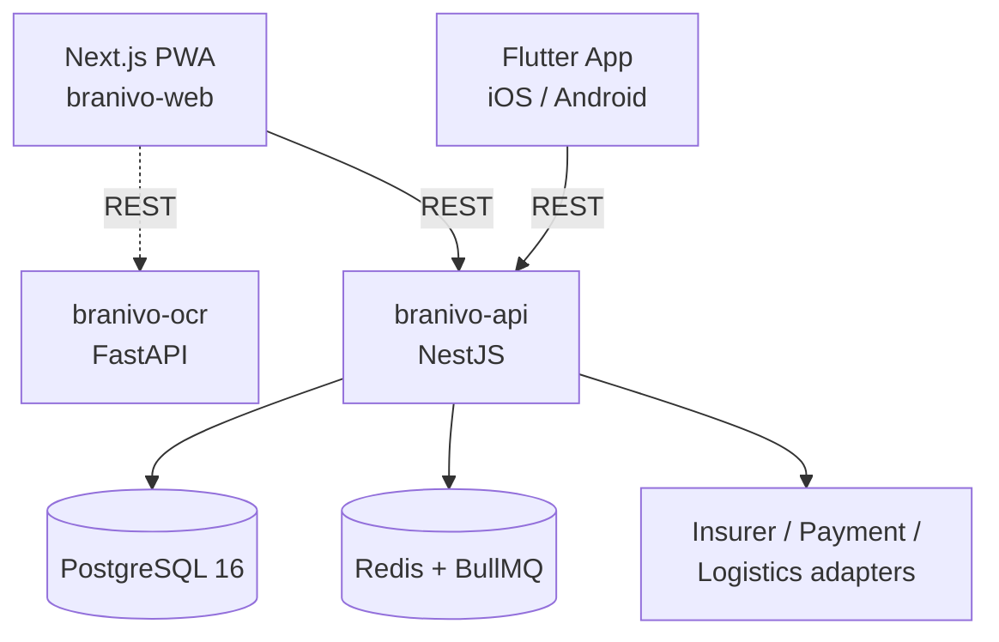

# Branivo

A white-label, multi-tenant B2B2C SaaS platform that lets insurance brokers run their own branded car-insurance storefront — end customers get a 90-second "photograph your registration, compare quotes, pay" flow; brokers get a dashboard, commission tracking, and fleet tools; Branivo runs the shared infrastructure underneath.

Four cooperating services — a NestJS API, a Next.js PWA, a Flutter mobile app, and a Python OCR microservice — share one PostgreSQL database and are provisioned on AWS via Terraform.

## Highlights

- **Anonymous-to-purchase in one session** — a visitor can scan their vehicle registration, get quotes from multiple insurers, and buy a policy before ever creating an account; a lightweight SMS-OTP registration is woven in only where the flow needs it, with OCR-extracted data carried forward automatically.
- **On-device OCR pipeline** — Flutter ML Kit + Google Vision extract MRZ/vehicle fields from a 3-step camera capture (owner page, vehicle identity page, technical-data page) with confidence scoring, graceful degradation, and a fallback path when confidence is too low. A standalone FastAPI service (`branivo-ocr`) handles server-side preprocessing (OpenCV) and MRZ parsing for the web flow.
- **Parallel multi-insurer quoting** — `Promise.allSettled` fan-out to insurer adapters (a common `InsurerAdapter` interface, one adapter class per insurer) with per-insurer timeouts and circuit breakers, so one slow/down insurer never blocks the others. Offers are ranked by a transparent, audited scoring formula (price/rating/claim-speed/extras) for regulatory (КФН) traceability.
- **White-label multi-tenancy** — host-based tenant resolution (Redis-cached, Postgres fallback) drives branding, custom domains, and per-tenant feature flags; every DB query is tenant-scoped through a request-bound `TenantContext`, with row-level security as a second line of defense.
- **Payments & commissions** — Stripe Connect with 3-D Secure, idempotent webhook-driven policy activation (a policy is never activated client-side), a broker commission dashboard with an immutable commission-snapshot model, monthly automated invoicing, and Apple Pay / Google Pay on mobile.
- **Renewal & notification engine** — a scheduled job walks expiring policies through a multi-channel escalation chain (push → SMS → email, D-30 through D+1) with per-tenant channel configuration and delivery fallbacks.
- **Fleet management** — bulk quoting/purchase, a fleet status dashboard, batch PDF export, and a scoped "driver" role for fleet operators managing many vehicles under one broker account.
- **Compliance by construction** — an append-only, hash-chained audit log; GDPR self-service (data export, consent tracking, cookie/ToS/privacy versioning, breach-response workflow); soft-delete everywhere with a physical-purge path; PII data classification.
- **Super Admin operations** — tenant health monitoring, per-tenant insurer-API circuit-breaker visibility, subscription tier management, and platform-wide broadcast notifications.

## Architecture



`branivo-web` is the client storefront + broker dashboard + super admin console; `branivo-api` enforces tenant isolation via `TenantContext` middleware on a strict `Controller → Service → Repository` layering; the adapter layer wraps every external integration (Stripe, insurer APIs, KAT, Гаранционен фонд, Speedy/Econt, SendGrid, Twilio, FCM) behind a per-integration circuit breaker.

AWS ECS Fargate (multi-AZ) runs the API, web, and OCR containers behind CloudFront/ALB; Terraform (`branivo-infra/`) defines dev/staging/prod as functionally identical environments (ECS, RDS, ElastiCache, S3, networking).

### `branivo-api` — NestJS 11, Modular Monolith

Domain modules (`auth`, `tenants`, `ocr`, `vehicles`, `quotes`, `policies`, `payments`, `commissions`, `billing`, `notifications`, `logistics`, `fleet`, `compliance`, `data-export`, `admin`, `vehicle-catalog`, `sessions`, `clients`, `users`, `insurers`, `renewal`) each follow a strict `Controller → Service → Repository` layering with no direct cross-module imports — inter-module communication goes through NestJS's `EventEmitter`. A `BaseRepository` enforces soft-delete scoping and tenant isolation by construction. Background work runs through three independently-scalable BullMQ queues (PDF generation, notifications, logistics), each with a thin processor that only dispatches to the owning service.

### `branivo-web` — Next.js 14 (App Router), PWA

Route groups split `(client)` storefront flows from the `(broker)` dashboard and `(admin)` super-admin console, all under `[locale]` for i18n (next-intl). TanStack Query drives server state with `staleTime: 0` on quote data — a regulatory requirement that prices never go stale — Zustand handles lightweight client/theme state, and `next-pwa` provides an offline-capable policy wallet. Internal `/api/v1/*` routes act as a typed BFF layer in front of the NestJS API.

### `branivo_app` — Flutter (iOS + Android), BLoC

Feature-sliced (`auth`, `onboarding`, `ocr`, `vehicles`, `vehicle_catalog`, `quotes`, `policies`, `payments`, `fleet`, `compliance`, `anonymous_session`, `registration`, `settings`), each with its own `bloc/`, `presentation/`, and `data/` layers. Hive stores offline policy/theme data; `flutter_secure_storage` (never Hive) holds auth tokens. Biometric login and Sign-in-with-Google sit alongside the OTP flow; `flutter_stripe` drives native Apple Pay / Google Pay checkout.

### `branivo-ocr` — FastAPI (Python)

A focused microservice for the web-side OCR path: OpenCV preprocessing, MRZ parsing, and VIN extraction from vehicle-registration photos, with its own rate limiting and a pytest suite that scores field-accuracy and confidence against a local fixture set (fixtures are intentionally excluded from version control — see `branivo-ocr/tests/fixtures/README.md`).

### `branivo-infra` — Terraform

Modules for `ecs`, `rds`, `redis`, `s3`, and `networking`, instantiated per environment under `environments/{dev,staging,prod}` so all three stay structurally identical.

## Tech Stack

| Layer | Technologies |
|---|---|
| Backend API | NestJS 11, TypeORM, PostgreSQL 16 (RLS), Redis 7, BullMQ, Passport/JWT, opossum (circuit breakers) |
| Web | Next.js 14 (App Router), React 18, TanStack Query, Zustand, Tailwind CSS, shadcn/ui, next-intl, next-pwa |
| Mobile | Flutter, BLoC, Hive, Dio, go_router, flutter_secure_storage, Google ML Kit, flutter_stripe |
| OCR service | FastAPI, OpenCV, Google Cloud Vision / AWS Textract fallback |
| Payments | Stripe Connect (3-D Secure, application-fee commissions, Apple Pay / Google Pay) |
| Infra | AWS ECS Fargate, RDS, ElastiCache, S3, CloudFront, Terraform, GitHub Actions |
| Integrations | SEC-style insurer APIs (per-insurer adapters), KAT (traffic police), Гаранционен фонд, Speedy/Econt, SendGrid, Twilio, Firebase Cloud Messaging |

## Getting Started

```bash
cp branivo-api/.env.example branivo-api/.env
cp branivo-web/.env.example branivo-web/.env
make up            # postgres + redis + pgadmin + mailhog (Docker)
make migrate        # TypeORM migrations
make dev            # API + web + Flutter, all wired to local infra
```

Common tasks are exposed as `make` targets — `make help` lists them all: `make test` (API + web), `make lint`, `make ci` (lint → test → build), `make ocr` / `make ocr-test` for the Python service, `make flutter-run` for the mobile app.

CI (`.github/workflows/`) runs separately for `branivo-api`, `branivo-web`, and `branivo_app`, path-scoped so each service only rebuilds on its own changes.
