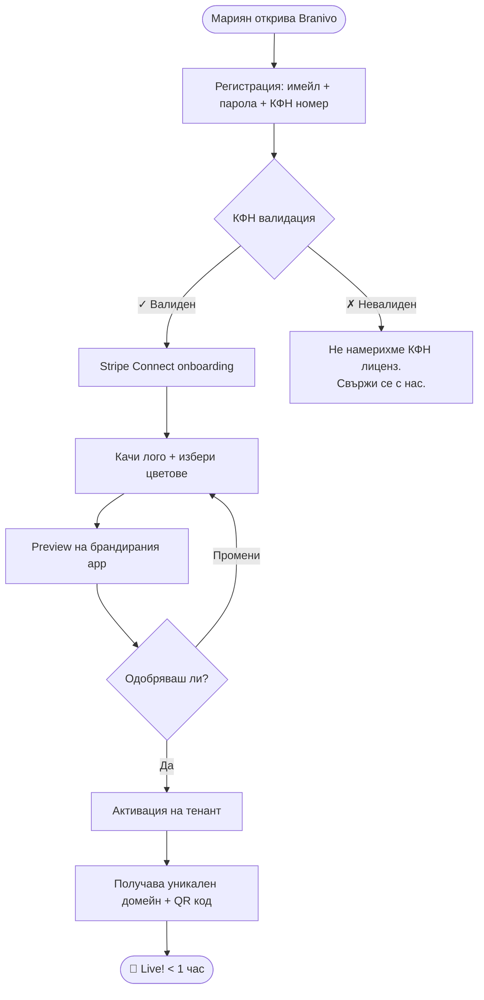
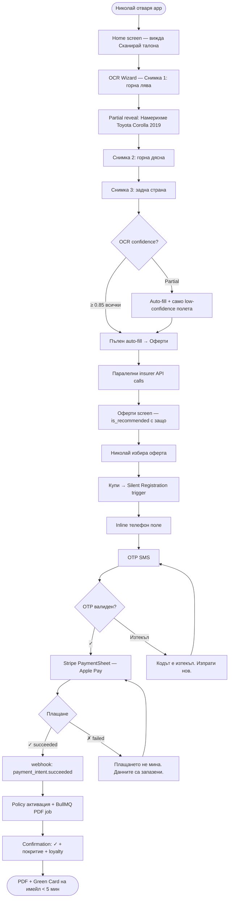
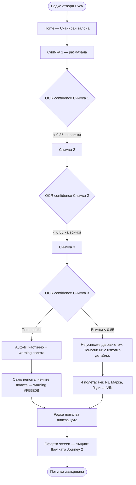
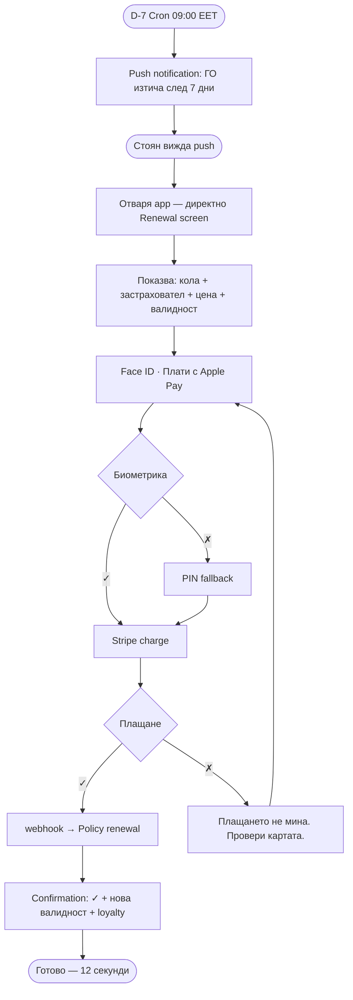
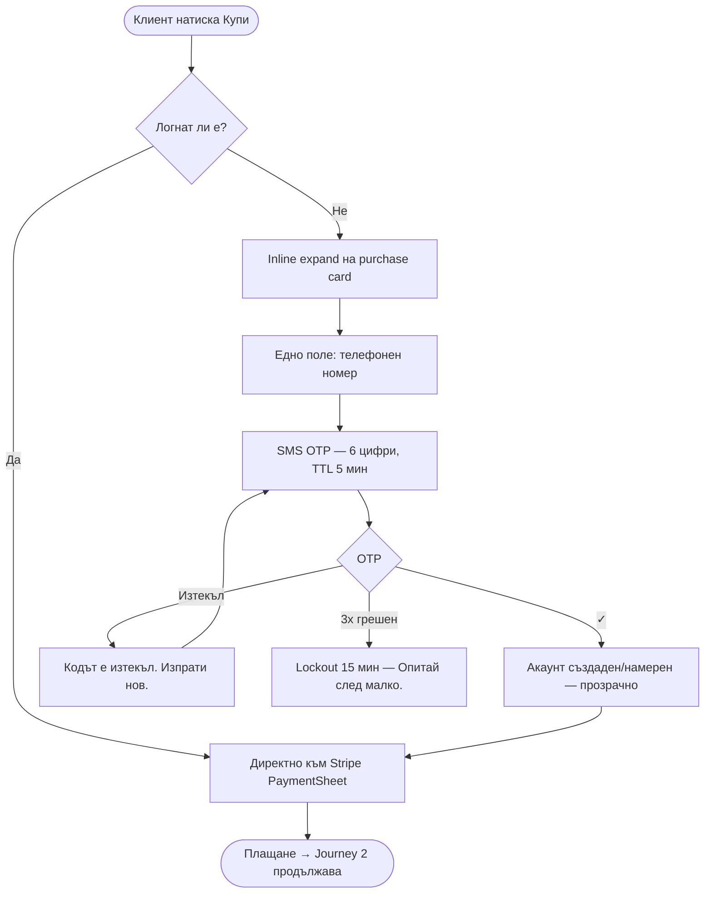

# UX Design Specification Branivo

**Author:** Daniel
**Date:** 2026-03-17

---

## Executive Summary

### Project Vision

Branivo е white-label B2B2C SaaS платформа, която дава на всеки застрахователен брокер собствен
брандиран дигитален канал (Flutter app + Next.js web + Broker Dashboard), активен в рамките на < 1
час. Платформата не носи застрахователен риск. Успехът се измерва с невидимост — крайният клиент
вижда само бренда на брокера.

### Target Users

| Persona | Профил | Ключова UX нужда |
|---------|--------|-----------------|
| **Мариян** (брокер) | 4 агента, 180 клиента, Excel манталитет | Прост dashboard; live < 1 час |
| **Николай** (нов клиент) | Мобилно-first, висока tech грамотност | Оферти < 30 сек, Apple Pay, без регистрация |
| **Радка** (нов клиент, 62г.) | Таблет с размазана камера | OCR fallback без crash, Add to Home Screen |
| **Стоян** (връщащ се) | Лоялен, бърз | Push → Face ID → Pay за 12 секунди |

### Key Design Challenges

1. **White-label illusion** — < 5% от крайните клиенти да разпознаят платформата. UX трябва да
   е 100% tenant-branded на всяко ниво — анимации, micro-copy, цветова схема.
2. **OCR за широка аудитория** — един flow, две скорости. Проектираме за Радка като baseline;
   Стоян получава скоростта си от Face ID + Apple Pay (системни, не наш UX проблем).
3. **Anonymous → micro-registration friction** — само телефон + OTP, inline в purchase flow,
   без redirect, без modal. Потребителят не трябва да осъзнава, че се е регистрирал.
4. **Broker Dashboard за Excel манталитет** — Мариян управлява полици, плащания и клиенти без
   обучение.

### Design Opportunities

1. **OCR като "wow момент"** — 3 снимки → оферти в < 30 сек е конкурентно предимство.
   Прогрес анимация + tenant branding правят момента театрален.
2. **Renewal като push → tap → done** — референс UX в застрахователния сектор.
3. **Tenant-level behavioral hints** — при onboarding брокерът декларира средна възраст на
   клиентите → платформата адаптира font size defaults и OTP timeout per tenant.
4. **Data strategy след launch** — OCR fallback rate след 30 дни разкрива реалното
   Радка/Стоян разпределение и информира следващите UX итерации.

---

## Core User Experience

### Defining Experience

Core loop: **OCR scan → оферти → покупка** — това е MVP приоритет #1.
Централен дизайн принцип: **"30-секундното обещание"** — всяко дизайн решение се
оценява с въпроса "Помага ли това потребителят да получи оферти по-бързо и по-уверено?"
Ако не помага — изрязваме го.

### Platform Strategy

- **App-first design, PWA parity** — проектираме за Flutter native, валидираме PWA
  равностойност. Радка не трябва да знае разликата между app и Add-to-Home-Screen.
- Touch-first, mobile-first (< 768px)
- Device capabilities: Camera (OCR), Face ID / Touch ID, Apple Pay / Google Pay,
  Push notifications
- Offline: само issued documents в wallet; quote flow = винаги online

### Effortless Interactions

| Interaction | Принцип |
|-------------|---------|
| OCR scan | 3 снимки → автоматично попълване; confidence ≥ 0.85 = auto-fill |
| OCR fallback | Показваме САМО полетата с нисък confidence — не цяла форма |
| Micro-registration | Само телефон + OTP, inline в purchase flow, без redirect |
| Renewal | Push → Face ID → Apple Pay — нула ръчни полета |
| Получаване на полица | PDF + Green Card автоматично по имейл < 5 мин |

### Critical Success Moments

1. **Scan success** — "Намерихме вашето МПС" — камерата разпознава талона,
   прогрес анимация, tenant-branded feedback
2. **Оферти се появяват** — < 30 сек, sorted by score, `is_recommended` badge видим,
   цени ясни и сравними
3. **Плащането минава** — Stripe confirmation → екран с брокерския бранд →
   "Готово, полицата е ваша"

### Experience Principles

1. **"30-секундното обещание"** — оферти преди всичко; registration, tutorials и
   onboarding са след покупката
2. **Проектирай за Радка, оптимизирай за Стоян** — baseline accessibility,
   системна скорост (Face ID, Apple Pay)
3. **Failure е дизайн момент** — OCR fallback показва само непопълнените полета;
   никога пълна форма като наказание
4. **Невидима платформа** — 100% tenant branding на всяко ниво; < 5% разпознаване
5. **App-first, PWA parity** — native Flutter experience е reference; PWA трябва
   да е равностоен, не degraded

---

## Desired Emotional Response

### Primary Emotional Goals

| Потребител | Момент | Целева емоция |
|------------|--------|---------------|
| Краен клиент | При сканиране | **Увереност** — "системата ме разбира" |
| Краен клиент | При оферти | **Контрол + Разбиране** — "аз избирам; системата познава моята ситуация" |
| Краен клиент | При покупка | **Облекчение + Удовлетворение** — "готово, и взех правилното решение" |
| Краен клиент | При failure | **Подкрепеност** — "помагат ми, не ме наказват" |
| Брокер | При клиентска покупка | **Гордост + Доверие** — "изглеждам като голям играч, системата работи за мен" |
| Брокер | При dashboard | **Майсторство и Собственост** — "аз изградих този бизнес" |

### Emotional Journey Mapping

**Нов клиент (Николай):**
```
Любопитство → Увереност → Разбиране → Облекчение + Удовлетворение
(отваря app)   (OCR работи)  (офертата е "за мен")  (полицата е купена)
```

**Нов клиент с OCR failure (Радка):**
```
Тревога → Подкрепеност → Контрол → Облекчение
(OCR се проваля) (само 2 полета, "помагаме")  (избира)  (готово)
```

**Връщащ се клиент (Стоян):**
```
Очакване → Лекота → Удовлетворение
(push notification) (Face ID → Pay)  (12 секунди, готово)
```

**Брокер (Мариян) при клиентска покупка:**
```
Прегледност → Гордост → Доверие
(вижда sale-а в dashboard) (собствен бранд) (Stripe разпредели комисионата)
```

### Micro-Emotions

| Искаме | Избягваме |
|--------|-----------|
| Увереност при сканиране | Тревога при OCR грешка |
| Контрол при избор на оферта | Объркване от прекалено много опции |
| **Разбиране** — "системата познава моята ситуация" | Generic insurance speak |
| Облекчение след покупка | Съмнение дали е минало плащането |
| Подкрепеност при failure | Срам или усещане за некомпетентност |
| Гордост + Майсторство у брокера | Усещане за generic/неразличим продукт |
| Доверие в платформата | Страх от данни и сигурност |

### Design Implications

| Емоция | UX подход |
|--------|-----------|
| **Увереност** при OCR | Реална прогрес анимация, tenant-branded feedback, конкретен резултат ("Намерихме: Toyota Corolla 2019") |
| **Разбиране** при оферти | `is_recommended` badge с 1 изречение динамично обяснение: "Препоръчано: най-бърза обработка на щети (24ч) + пълно покритие" |
| **Контрол** при оферти | Ясна сортировка, transparent scoring, без агресивен натиск |
| **Облекчение + Удовлетворение** | Два отделни екрана: (1) голям checkmark "Готово!" (2) резюме на покритието "Взехте правилното решение" |
| **Подкрепеност** при failure | "Помогни ни с няколко детайла" — само непопълнени полета, без пълна форма |
| **Майсторство** у брокера | Dashboard с MRR горе вляво, live нотификации за нови продажби, subtle micro-celebration при всяка нова полица |

### Emotional Design Principles

1. **"Помагаме, не съдим"** — при всяка грешка tone-ът е подкрепящ, не технически
2. **"Двойна победа при покупка"** — облекчение (checkmark) + удовлетворение (покритие резюме) на два отделни екрана
3. **"Разбиране над цена"** — BG пазар: потребителят плаща повече ако му е обяснено защо. `is_recommended` = динамично "защо", не просто badge
4. **"Невидима гордост за клиента, видима за брокера"** — клиентът вижда само брокерския бранд; брокерът вижда своя бизнес в Dashboard
5. **"Доверие = бързина + обяснение"** — техническо доверие (< 30 сек) + съдържателно доверие (защо тази оферта е за теб)

---

## UX Pattern Analysis & Inspiration

### Inspiring Products Analysis

| Продукт | Какво правят добре | Слабост (наша възможност) |
|---------|-------------------|--------------------------|
| **Lemonade** | Human tone, AI-assisted onboarding, instant claims, behavioral economics (giveback) | D2C само, не white-label; не работи за BG broker модел |
| **Boleron** | Мулти-застрахователно сравнение, бърз quote flow за BG | Ръчно въвеждане, generic бранд, функционален без емоция |
| **24ins.bg** | Изградено доверие и brand recognition в BG | Legacy desktop-first UX, тромав мобилен, без anonymous flow |
| **Amarant** | По-модерен визуален дизайн, по-добро мобилно изживяване | Generic бранд, без OCR, без white-label |
| **SDI** | Силна brand recognition, broker network | Legacy система, тежък onboarding, без digital-first |

**Ключово наблюдение:** Нито един BG конкурент няма OCR, white-label или anonymous-first flow.
Lemonade има емоционалния UX, но не работи за broker модела. Branivo комбинира двете.

### Transferable UX Patterns

**От Lemonade:**
- **Human tone навсякъде** — micro-copy е разговорен, не legalistic. "Намерихме вашето МПС!" вместо "Данните са обработени успешно."
- **Двата слоя текст** — human layer (голям, разговорен) + regulatory layer (малък, collapsible "Виж пълните условия"). КФН compliance без да жертваме human tone.
- **Progress celebration** — всяка стъпка се потвърждава с позитивен feedback
- **Instant gratification** — резултатът идва бързо и е dramatized (анимация, визуален impact)
- **Loyalty като micro-delight** — reward веднага след покупката, докато емоционалното състояние е позитивно

**От Boleron / 24ins.bg / Amarant:**
- **Ценова прозрачност** — всички оферти наредени, без скрити такси
- **Сравнителна структура** — лесна за разбиране без застрахователни познания
- **Доверие чрез познатост** — лога на застрахователите (ДЗИ, Алианц, Булстрад) изграждат доверие

### Anti-Patterns to Avoid

| Anti-pattern | Откъде идва | Защо го избягваме |
|-------------|-------------|-------------------|
| **Ръчно въвеждане на всички данни** | Boleron, 24ins.bg, SDI | OCR е нашето конкурентно предимство — никога не падаме до пълна форма |
| **Desktop-first layout** | 24ins.bg, SDI | BG потребителите са mobile-first; desktop е secondary |
| **Registration преди оферти** | Повечето BG платформи | Убива конверсията в момента на най-висок intent |
| **Generic бранд без personalization** | Всички BG конкуренти | White-label illusion е core value; никога не показваме "Branivo" на крайния клиент |
| **Legalistic micro-copy** | Индустриен стандарт | Говорим на езика на потребителя, не на застрахователя |
| **Error screens вместо помощ** | Legacy системи | При failure — "Помогни ни с няколко детайла", не "Грешка 422" |

### Design Inspiration Strategy

**Adopt от Lemonade:**
- Human, разговорен tone навсякъде в micro-copy
- Двата слоя текст (human + regulatory) — задължително за КФН compliance
- Progress celebration на всяка стъпка от OCR wizard-а
- Loyalty points на confirmation screen — трети емоционален слой след облекчение и удовлетворение

**Confirmation screen структура:**
1. ✅ "Готово, полицата е ваша!" — облекчение
2. 📋 Резюме на покритието — удовлетворение
3. ⭐ "Спечелихте 12 точки (1.20 BGN)" — micro-delight

**Adopt от BG конкурентите:**
- Ценова прозрачност и сравнителна структура на офертите
- Лога на познати застрахователи за изграждане на доверие

**Adapt за Branivo:**
- Lemonade chatbot → наш OCR wizard (3 снимки вместо въпроси)
- Boleron сравнение → наше сравнение + `is_recommended` с динамично "защо"
- Amarant модерен дизайн → наш design + 100% tenant branding отгоре

**White-label design система като barrier to entry:**
Не е theming — е пълна design система: tenant анимации, font пакети, copy tone per брокер,
onboarding flows. Месеци за изграждане, невъзможна за копиране за 3-6 месеца от конкурент.

**Avoid изцяло:**
- Всякакъв flow изискващ регистрация преди оферти
- Desktop-first layout decisions
- Generic платформен бранд видим за крайния клиент

---

## Design System Foundation

### Design System Choice

| Платформа | Система | Подход |
|-----------|---------|--------|
| **Flutter (mobile app)** | Material 3 (`flutter_material`) | Пълна theme customization per tenant чрез `ThemeData` |
| **Next.js (web/PWA)** | Tailwind CSS + shadcn/ui | Headless компоненти, 100% стилизируеми, без imposed visual identity |

### Rationale for Selection

- **White-label изискване:** И двете системи позволяват пълна визуална кастомизация per тенант — цветове, шрифтове, радиус, elevation — без да се налага да пишем компоненти от нулата
- **Скорост на разработка:** Proven компоненти с built-in accessibility; екипът се фокусира върху бизнес логиката, не върху бутони и input полета
- **Tenant theming:** Flutter `ThemeData` + CSS variables в Tailwind позволяват runtime theme switching per тенант от единна конфигурация
- **Общност и поддръжка:** Material 3 и shadcn/ui имат активни общности, добра документация и редовни updates

### Implementation Approach

**Flutter — Design Tokens per Tenant:**
```
TenantTheme {
  primaryColor, secondaryColor,
  fontFamily, borderRadius,
  logoUrl, splashImageUrl
}
→ ThemeData.from(colorScheme: ...) при app init
```

**Next.js — CSS Variables per Tenant:**
```
:root {
  --primary: {tenant.primaryColor};
  --font-sans: {tenant.fontFamily};
  --radius: {tenant.borderRadius};
}
→ Injected from middleware via Host header
```

### Customization Strategy

- **Level 1 — Tokens (задължително за всеки тенант):** Primary/secondary цветове, лого, шрифт
- **Level 2 — Components (опционално):** Кастомни анимации, splash screen, onboarding imagery
- **Level 3 — Flows (Enterprise):** Различен onboarding flow, custom home screen layout
- **Invariant:** Компонентната библиотека е обща — само визуалните tokens се менят. Никога не дублираме компоненти per тенант.

---

## 2. Core User Experience

### 2.1 Defining Experience

**"Снимаш талона, получаваш оферти"**

Определящото изживяване на Branivo: потребителят снима талона на
колата (3 зуумирани секции) → системата разпознава МПС-то автоматично →
оферти от множество застрахователи се появяват в < 30 секунди,
без ръчно въвеждане, без регистрация.

Метафора за потребителя: "Като сканиране на QR код" — познато
действие, нулево обяснение нужно.

### 2.2 User Mental Model

**Текущо очакване (което чупим):** "Ще попълня много полета, ще
отнеме много време, ще трябва да се регистрирам."

**Новото очакване (което създаваме):** "Снимам → системата знае
всичко → избирам → плащам."

**Ключовото прекъсване на очакването** е "wow момента" —
именно там се печели word-of-mouth.

### 2.3 Success Criteria

| Критерий | Мярка |
|----------|-------|
| OCR разпознаване | < 10 сек от последната снимка |
| Оферти на екрана | < 30 сек от старта на scan |
| OCR fallback rate | < 10% от сесиите |
| Drop-off в OCR wizard | < 15% |
| "Wow момент" усещане | Потребителят вижда "Намерихме: [марка модел година]" |

### 2.4 Novel UX Patterns

**Нови patterns, нуждаещи се от обучение:**

1. **3-стъпков OCR wizard** — нов за BG застраховки:
   - Guidance overlay при първа употреба: frame guide per секция
   - Live camera preview с правоъгълна рамка "Наредете талона в рамката"
   - Progressive reveal: след всяка снимка показваме разпознатото
   - При повторна употреба — guidance изчезва (experienced user flow)

2. **Anonymous-first quote** — нов за BG пазара:
   - Без registration prompt преди оферти
   - Micro-registration inline при "Купи" — потребителят не трябва
     да осъзнава, че се е регистрирал

### 2.5 Experience Mechanics

**3 зуумирани секции (не 2 далечни снимки):**

| Снимка | Секция | Ключови полета |
|--------|--------|----------------|
| 1 | Горна лява на Част 1 | Рег. номер, Марка, Модел, VIN (17 символа) |
| 2 | Горна дясна на Част 1 | Собственик, дата на първа регистрация |
| 3 | Част 2 (задна страна) | (G) двигател cm³, (J) категория, гориво, места |

**Обосновка:** 2 далечни снимки дават недостатъчна pixel density за
надежден OCR (< 0.85 confidence на критичните полета). 3 зуумирани
секции постигат confidence > 0.85 и fallback rate < 10%.

**Adaptive flow:**

```
1. INITIATION
   Голям CTA: "Сканирай талона" + иконка камера
   Hint: "3 снимки, 30 секунди"

2. INTERACTION
   Снимка 1 → frame guide "Горна лява секция" → capture
             → partial reveal: "Намерихме: [Марка Модел]"
   Снимка 2 → frame guide "Горна дясна секция" → capture
             → partial reveal: "Собственик: [Име]"
   Снимка 3 → frame guide "Задна страна" → capture
             → пълен резултат

3. FEEDBACK
   Success:  "Намерихме вашето МПС: [Марка Модел Година]"
             Tenant-branded анимация, зелена checkmark
   Partial:  Показваме попълненото + само непопълнените полета
   Failure:  "Помогни ни с няколко детайла" — 2-3 полета max

4. COMPLETION → ОФЕРТИ
   Animated transition към оферти screen
   < 30 сек от старта на scan
   is_recommended badge с динамично "защо"
```

---

## Visual Design Foundation

### Color System

**Platform Default Theme (Broker Dashboard + клиентски app baseline):**

| Token | Стойност | Употреба |
|-------|----------|----------|
| `primary` | `#6366F1` | CTA бутони, active states, links |
| `secondary` | `#0D9488` | Secondary actions, icons, highlights |
| `accent` | `#10B981` | Success states, checkmarks, "Готово" |
| `surface` | `#FAFAFA` | Background, карти |
| `text` | `#111827` | Body text, headings |
| `error` | `#EF4444` | Грешки, validation |
| `warning` | `#F59E0B` | Предупреждения, OCR low confidence |

**Tenant Override:** Тенантът замества `primary` и `secondary` с неговите цветове.
Останалите tokens остават непроменени. Индиго + тийл като базови са complementary
с повечето tenant палитри (синьо, червено, зелено) — без визуален конфликт.

**Диференциация:** Нито един основен BG застраховател не използва индиго —
визуалното разграничение е умишлено и стратегическо.

### Typography System

**Primary font:** Inter (Google Fonts — отлична Кирилица, безплатен)
**Fallback:** system-ui, -apple-system, sans-serif

| Scale | Size | Weight | Употреба |
|-------|------|--------|----------|
| Display | 32px | 700 | OCR success "Намерихме вашето МПС!" |
| H1 | 24px | 700 | Screen titles |
| H2 | 20px | 600 | Section headers |
| H3 | 17px | 600 | Card titles |
| Body | 16px | 400 | Основен текст (**минимум 16px — accessibility**) |
| Small | 14px | 400 | Secondary info, metadata |
| Caption | 12px | 400 | Regulatory layer, legal text |

### Spacing & Layout Foundation

**Base unit:** 8px (Material 3 + Tailwind стандарт)

| Token | Стойност | Употреба |
|-------|----------|----------|
| `space-1` | 8px | Вътре в компоненти |
| `space-2` | 16px | Между елементи |
| `space-3` | 24px | Секции |
| `space-4` | 32px | Между карти |
| `space-6` | 48px | Главни секции |

**Layout:** Mobile-first, single column (< 768px).
Максимална ширина на съдържанието: 480px центрирано.
Bottom navigation bar за primary actions на мобилен.
**Border radius:** 12px за карти, 8px за бутони, 6px за inputs.

### Accessibility Considerations

- Минимален body font size: **16px** (за Радка и всички 60+ потребители)
- Контраст ratio: минимум **4.5:1** за body text (WCAG AA)
- Touch targets: минимум **48×48px** за всички интерактивни елементи
- Inter шрифтът има отлична Кирилица поддръжка на всички размери
- `warning` (#F59E0B) за OCR low confidence полета — визуален сигнал без error

---

## Design Direction Decision

### Design Directions Explored

6 екранни направления са разработени и визуализирани в `ux-design-directions.html`:

| # | Екран | Ключова демонстрация |
|---|-------|---------------------|
| 1 | Client Home | Clean minimal, OCR като главен CTA, bottom navigation |
| 2 | OCR Wizard | Dark mode, frame guide, progress steps, partial reveal |
| 3 | Оферти | `is_recommended` с динамично "защо", Value Justification |
| 4 | Confirmation | 3 емоционални слоя — checkmark + покритие резюме + loyalty |
| 5 | Broker Dashboard | MRR prominent, live sales notifications, KPI grid |
| 6 | Renewal (Стоян) | Dark mode, Push → Face ID → Pay flow |

### Chosen Direction

**Unified direction** — всички 6 екрана формират един кохерентен дизайн език:

- **Client app:** Light mode (surface #FAFAFA) с индиго primary CTA
- **OCR Wizard:** Dark mode (#111827) за фокус върху камерата
- **Broker Dashboard:** Light mode с индиго header и prominent MRR
- **Renewal:** Dark mode за нощни/push notification контексти

### Design Rationale

- **Dark mode за OCR wizard:** Камерата се вижда по-добре на тъмен background; намалява distraction
- **Light mode за оферти и confirmation:** Финансова информация се чете по-лесно на светъл background
- **Индиго primary навсякъде:** Визуална нишка свързва всички екрани независимо от light/dark mode
- **Bottom navigation:** Стандарт за мобилни apps; thumb-friendly за едноръко ползване

### Implementation Approach

- Flutter: `ThemeData.light()` и `ThemeData.dark()` — switching per screen context
- Tenant замества само `primary` и `secondary` tokens; light/dark логиката остава
- HTML showcase (`ux-design-directions.html`) служи като living reference за developers

---

## User Journey Flows

### Error Messages (Platform-wide)

| Ситуация | Human Layer (видим) | Следваща стъпка |
|----------|---------------------|-----------------|
| Insurer API timeout | "Някои застрахователи не отговориха навреме. Показваме наличните оферти." | ⚠️ badge + "Опитай отново" след 30 сек |
| Stripe payment failure | "Плащането не мина. Провери картата и опитай отново — твоите данни са запазени." | Retry без да губим OCR данните (Redis TTL 48ч) |
| OCR complete failure | "Не успяхме да разчетем талона. Помогни ни с няколко детайла." | Само 4 задължителни полета: Рег. №, Марка/Модел, Година, VIN |
| OTP изтекъл | "Кодът е изтекъл. Изпрати нов." | Resend button, без error styling |
| Quote изтекъл (48ч) | "Офертата е изтекла. Сканирай отново — отнема само 30 секунди." | CTA към OCR wizard |
| ГФ / KAT недостъпни | "Не можем да проверим задълженията автоматично. Брокерът ще провери ръчно преди активация." | Прозрачност без паника |

**Tone правило:** "Какво се случи (без technical jargon)" + "Какво правим сега" + "Какво трябва да направиш ти"
Никога: "Error 422", "Session expired", "API unavailable"

---

### Journey 1 — Broker Onboarding (Мариян)

**Goal:** Брокерът активира собствен канал в < 1 час след регистрация.



### Journey 2 — Нов клиент купува ГО (Николай)

**Goal:** Сканира талона → оферти → плаща за < 3 минути.



### Journey 3 — OCR Failure (Радка)

**Goal:** Graceful fallback без crash, без паника.



### Journey 4 — Renewal (Стоян)

**Goal:** Push → Face ID → Pay за 12 секунди, нула ръчни полета.



### Journey 5 — Silent Registration

**Goal:** Micro-registration inline, потребителят не осъзнава регистрацията.



### Journey Patterns

**Navigation:**
- Back винаги е видим; never trap потребителя в стъпка
- Bottom nav скрит по време на OCR wizard и payment flow (фокус)

**Decision Points:**
- Maximum 2 избора на екран; никога повече от 3
- Default/препоръчан избор винаги предварително избран

**Feedback:**
- Progress indicator за всеки multi-step flow
- Success state винаги с позитивна анимация + tenant color
- Error state никога червен full-screen — само inline warning

### Flow Optimization Principles

1. **Zero dead ends** — всеки error има explicit следваща стъпка
2. **Data persistence** — OCR данни и quote избор в Redis 48ч; никога не губим прогреса
3. **Graceful degradation** — partial OCR > пълна форма; partial offers > no offers
4. **Invisible registration** — micro-reg е вграден в purchase flow, не прекъсва го

---

## Component Strategy

### Design System Components (без custom работа)

**Material 3 (Flutter) + shadcn/ui (Next.js) покриват:**
Бутони (primary/secondary/outlined), Text inputs + validation, Bottom navigation bar, Cards + списъци, Dialogs/modals, Progress indicators (linear/circular), Snackbars/toasts, Badges, Chips/tags.

### Custom Components

#### 1. OCR Camera Wizard
**Purpose:** 3-стъпков сканиращ wizard за разпознаване на талон
**Usage:** Journey 2, 3 — core experience, home screen CTA
**Anatomy:** Camera preview + frame guide overlay + progress steps + capture button + partial reveal area
**States:** `idle` → `capturing` → `processing` → `success` → `partial` → `failure`
**Variants:** Step 1 (горна лява) / Step 2 (горна дясна) / Step 3 (задна страна)
**Accessibility:** Voice feedback при capture; alto contrast frame guide
**Interaction:** Live preview с правоъгълна рамка → tap to capture → animated processing → reveal

#### 2. Offer Card
**Purpose:** Показва оферта от застраховател с pricing и is_recommended reasoning
**Usage:** Journey 2 — оферти screen
**Anatomy:** Insurer logo + name | Price | is_recommended badge + reason | Features chips | CTA button
**States:** `default` | `recommended` (indigo border) | `unavailable` (greyed, ⚠️)
**Variants:** Compact (list) / Expanded (selected)
**Accessibility:** Screen reader: "ДЗИ, 189 лева годишно, препоръчано: най-бързо изплащане"
**Content:** is_recommended reason — max 1 изречение, динамично от winning attributes

#### 3. Silent Registration Inline
**Purpose:** Micro-registration без да прекъсва purchase flow
**Usage:** Journey 5 — при натискане на "Купи" от анонимен потребител
**Anatomy:** Inline expand на offer card → phone field → OTP field → submit
**States:** `collapsed` → `phone_entry` → `otp_sent` → `otp_entry` → `verified`
**Accessibility:** Auto-focus на phone field при expand; OTP field auto-submit при 6 цифри
**Interaction:** Smooth expand animation (не modal, не redirect); OTP auto-paste от SMS

#### 4. Policy Card
**Purpose:** Показва активна полица в wallet/home screen
**Usage:** Home screen, My Policies screen
**Anatomy:** Vehicle icon + марка/модел | Тип (ГО) | Валидност | Status badge | Renewal CTA (ако < 30 дни)
**States:** `active` (green) | `expiring_soon` (amber, < 30 дни) | `expired` (red)
**Variants:** Compact (list) / Full (wallet view с PDF бутон)
**Accessibility:** Expiring soon — screen reader announcement при отваряне

#### 5. Confirmation Screen
**Purpose:** Три емоционални слоя след успешна покупка
**Usage:** Journey 2, 4 — след payment_intent.succeeded
**Anatomy:** (1) Hero checkmark + "Готово!" | (2) Coverage summary card | (3) Loyalty reward chip
**States:** `animating_in` → `static`
**Interaction:** Hero checkmark animate-in (scale + fade); coverage card slide-up; loyalty chip pulse
**Tenant:** Checkmark цвят = tenant primary; background gradient = tenant primary → secondary

#### 6. Broker MRR Widget
**Purpose:** Prominent MRR display с growth indicator — "майсторство и собственост"
**Usage:** Broker Dashboard — top card
**Anatomy:** Label "МЕСЕЧЕН ПРИХОД" | Large MRR number | Growth % vs минал месец | Mini sparkline
**States:** `positive_growth` (зелено) | `flat` (сиво) | `negative` (amber — не червено)
**Variants:** Full (dashboard) / Compact (widget)
**Interaction:** Tap → детайлна breakdown по период

#### 7. Renewal Quick Pay
**Purpose:** One-tap renewal с биометрика — нула ръчни полета
**Usage:** Journey 4 — renewal screen от push notification
**Anatomy:** Policy summary card | Price prominent | Face ID / Apple Pay CTA | "Напомни по-късно" link
**States:** `ready` | `authenticating` | `processing` | `success`
**Interaction:** Full-screen takeover при отваряне от push; биометрика CTA е primary и dominant

### Component Implementation Strategy

- Всички custom компоненти използват design tokens — никакви hardcoded цветове
- Tenant theme се инжектира отвън; компонентите са theme-agnostic
- Flutter: всеки custom компонент е отделен `Widget` в `lib/shared/widgets/`
- Next.js: всеки custom компонент е в `components/ui/` с Tailwind + CSS variables

### Implementation Roadmap

**Phase 1 — MVP Critical (Journey 2 + 3 + 5):**
1. OCR Camera Wizard — без него няма product
2. Offer Card — без него няма conversion
3. Silent Registration Inline — без него губим 30-40% при "Купи"
4. Confirmation Screen — без него няма emotional payoff

**Phase 2 — Retention (Journey 4):**
5. Policy Card — wallet experience
6. Renewal Quick Pay — Стоян flow

**Phase 3 — B2B (Journey 1):**
7. Broker MRR Widget — dashboard experience

---

## UX Consistency Patterns

### Button Hierarchy

| Ниво | Употреба | Стил | Пример |
|------|----------|------|--------|
| **Primary** | Главното действие на екран | Filled indigo, 48px height | "Сканирай талона", "Купи", "Плати" |
| **Secondary** | Алтернативно действие | Outlined indigo, 48px height | "Избери", "Виж детайли" |
| **Tertiary** | Деструктивно / dismissive | Text only, no background | "Напомни по-късно", "Пропусни" |
| **Danger** | Необратими действия | Filled red — само след confirmation dialog | "Откажи полица" |

**Правила:** Максимум 1 Primary бутон на екран. Primary CTA винаги в долната част (thumb zone). Minimum touch target: 48×48px.

### Feedback Patterns

**Success:** Голяма зелена анимация (scale-in checkmark) + tenant primary color. Toast "Готово!" — 3 сек. Никога modal за success.

**Error (inline):** Червен текст под засегнатото поле. Иконка ⚠️ + human message. Field остава попълнен.

**Warning:** Amber (#F59E0B) border на засегнатите полета. Снекбар не се auto-dismiss. Употреба: OCR low confidence, KAT/ГФ недостъпни.

**Loading:**
- Skeleton screens за списъци (не spinner)
- **Progressive offer reveal** — офертите се появяват с `Promise.allSettled()`: skeleton → first offer animate-in → second → ... → last. Изгражда очакване, прави < 30 сек да изглежда по-бързо.
- Spinner само за действия < 3 сек
- Branded text за OCR processing: "Разчитаме талона..."

### Form Patterns

**Validation:**
- **On blur** — за всички стандартни полета (не on keystroke)
- **Auto-submit** — OTP: auto-submit при 6-та цифра, без blur/бутон
- **Real-time** — VIN: character count в реално време (от 17 символа)

**Input types:**
- Телефон: `+359` prefix fixed, числово keyboard, auto-format
- OTP: 6 отделни box-а, auto-advance, auto-paste от SMS
- VIN: capitals only, 17 chars, real-time length indicator
- Рег. номер: uppercase, BG формат hint

**Auto-fill:** OCR резултати auto-fill с subtle indigo highlight flash. Low confidence полета: amber border + placeholder "Провери".

**OCR Partial Results:** Bottom sheet (`DraggableScrollableSheet`) върху camera резултата — потребителят вижда контекста отзад, коригира отпред.

### Navigation Patterns

**Bottom Navigation:** 4 таба: Начало / Полици / Чат / Профил. Скрит при OCR wizard, payment flow, confirmation screen.

**Back Navigation:** Винаги видим. При destructive back (от payment): confirmation dialog. Deep link от push → директно към target screen.

**App State:** При foreground от push → restore exact screen. При background > 30 мин → refresh данни, запази navigation position.

### Empty States

**Клиент — без полици:** "Нямаш активни полици" + "Сканирай талона" CTA.

**Broker — без клиенти (Share Screen):**
- QR код (голям, centrен) — статичен PNG от tenant domain, генериран при активация
- [WhatsApp] [Копирай линк] — secondary actions
- Native OS share sheet (`flutter_share`)
- При първа продажба → micro-celebration: "🎉 Първа продажба! [Клиент] купи ГО за [МПС]."

Никога "Няма данни" без next step CTA.

### Modal & Overlay Patterns

**Използва се modal:** Confirmation за деструктивни действия. Legal text ("Виж пълните условия").

**НЕ се използва modal:** Registration (→ inline), Error messages (→ inline), Success (→ full screen/toast), Loading (→ skeleton), OCR partial results (→ bottom sheet).

**Bottom sheets:** Preferred над modals за мобилен — natural thumb gesture за dismiss.

---

## Responsive Design & Accessibility

### Responsive Strategy

**Философия: App-first, Web-parity**

Branivo съществува в два канала — Flutter native app и Next.js PWA. Responsive стратегията не е "как да накараме desktop сайт да работи на мобилно", а "как да доставим app-качество в браузър, и как да използваме по-голям екран когато е наличен".

**Flutter (native app):**
Таргетираме 360–428px ширина (Android flagship + iPhone Pro range). Material 3 adaptive layouts се активират автоматично. Tablet (≥ 600dp) използва `NavigationRail` вместо `BottomNavigationBar`. OCR wizard е вертикален на телефон, хоризонтален split (preview 60% / форма 40%) на таблет — при confidence < 0.85 на tablet: автоматичен overlay "Приближи камерата" (гласово TalkBack/VoiceOver + визуален hint), за да не паникосва Радка пред мъгляво preview.

**Next.js PWA:**
Mobile-first CSS. Quote flow, confirmation, policy wallet — идентични с Flutter по функция, адаптирани за touch + Add to Home Screen (A2HS). Desktop Broker Dashboard е отделен layout — sidebar navigation + data-dense tables.

**Стратегия по тип потребител:**

| Канал | Primary device | Secondary | Стратегия |
|-------|---------------|-----------|-----------|
| Краен клиент | Телефон (Flutter) | Таблет (web PWA) | App-first; web = fallback за Радка |
| Брокер | Desktop (web dashboard) | Телефон (Flutter) | Dashboard: max data density; mobile: key actions only |

---

### Breakpoint Strategy

| Breakpoint | Range | Layout | Navigation |
|-----------|-------|--------|------------|
| **Mobile S** | 320–374px | Single-column, 16px margins | Bottom nav (4 items) |
| **Mobile** | 375–767px | Single-column, 20px margins | Bottom nav (4 items) |
| **Tablet** | 768–1023px | Single/Two-column хибрид | NavigationRail (Flutter) / Side tabs (PWA) |
| **Desktop** | 1024–1439px | Multi-column, sidebar | Left sidebar, content area + right panel |
| **Desktop L** | 1440px+ | Max-width 1280px, centered | Same as Desktop |

**Критични breakpoint решения:**

**OCR Wizard:** Вертикален stack < 768px (full-screen camera → form overlay). Split view ≥ 768px (камера вляво 60% / форма вдясно 40%). При tablet + confidence < 0.85: overlay hint преди split.

**Offers Screen:** Single card stack < 768px (swipeable). Grid 2-up ≥ 768px. Grid 3-up ≥ 1024px. Offer cards използват `minHeight` (не fixed height) — при text scale factor > 1.3 картата расте вертикално, не overflow-ва.

**Broker Dashboard:** Скрит на < 768px — мобилните брокери ползват Flutter app с опростен изглед (само today's sales + quick actions). Full dashboard ≥ 768px.

**Flutter Material 3 Breakpoints (dp):**
- Compact: 0–599dp → BottomNavigationBar
- Medium: 600–839dp → NavigationRail
- Expanded: 840dp+ → NavigationDrawer (за Dashboard only)

---

### Accessibility Strategy

**Target: WCAG 2.1 Level AA** — industry standard, законово препоръчителен за финансови услуги.

Радка (62г.) е нашият accessibility baseline: ако тя може да завърши OCR flow без помощ, всеки може.

**Цветове и контраст:**

| Елемент | Foreground | Background | Ratio | AA? |
|---------|-----------|-----------|-------|-----|
| Body text | #111827 | #FFFFFF | 16.1:1 | ✅ |
| Indigo CTA | #FFFFFF | #6366F1 | 5.7:1 | ✅ |
| Teal accent | #FFFFFF | #0D9488 | 5.1:1 | ✅ |
| Placeholder text | #9CA3AF | #FFFFFF | 2.9:1 | ⚠️ decorative only |
| Error text | #DC2626 | #FFFFFF | 5.8:1 | ✅ |
| Amber warning | #92400E | #FEF3C7 | 7.2:1 | ✅ |

Placeholder е декоративен — никога не носи единствен informational content. **ПРАВИЛО:** `<input placeholder="Рег. номер" />` е ЗАБРАНЕНО без видим `<label>` или `aria-label`. Задължителен visible label за всеки input.

**Typography:**

| Контекст | Min Size | Target Size |
|----------|---------|-------------|
| Body (всички) | 16px / 1rem | 16–18px |
| Labels, hints | 14px | 14px |
| Legal text (collapsed) | **14px** | 14px (expand за четене) |
| Legal text (expanded) | 14px | 16px |
| CTA buttons | 16px medium | 16px semibold |
| Heading H1 | 24px | 28–32px |

**Touch Targets:** Minimum 48×48px (Android Material) / 44×44pt (iOS HIG). Всички бутони, иконки, ссилки — спазват.

**Специфични Branivo accessibility requirements:**

1. **OCR Wizard:** `Semantics()` widget за всяка камера стъпка с ясна инструкция. При VoiceOver/TalkBack: spoken guidance "Насочи камерата към горния ляв ъгъл на талона." При tablet + confidence < 0.85: overlay hint се анонсира като `liveRegion`.

2. **OTP полета:** 6 отделни input box-а → `autofillHints: [AutofillHints.oneTimeCode]`. SMS auto-fill работи нативно на iOS/Android.

3. **Offer cards:** Screen reader чете: "[Застраховател] — [Цена] лева годишно. [Ако е recommended: Препоръчан — причина]." Cards използват `minHeight` + `LayoutBuilder` за extreme text scaling (1.5x, 2.0x) — текстът не overflow-ва.

4. **Progress indicators:** Всеки step в OCR wizard → `Semantics(label: 'Стъпка 1 от 3')`.

5. **Error messages:** Всяка грешка → `aria-live: assertive` (Next.js) / Flutter `Semantics(liveRegion: true)`.

6. **Two-layer legal text:** Минимум 14px дори в collapsed вид. "Виж условията" expand — `Semantics(button: true, label: 'Разгъни пълните условия')`.

7. **Dynamic type support:** Flutter — `MediaQuery.textScaleFactor` respect (не override). При scale > 1.3 → `LayoutBuilder` + `FittedBox` като fallback за Offer Card и OCR wizard steps. При scale > 1.5 → layout adjusts вертикално, не truncate.

8. **Reduced motion:** `MediaQuery.disableAnimations` → OCR progress animation → simple color change вместо lottie. Offer reveal → instant показване без stagger.

---

### Testing Strategy

**Responsive Testing:**

| Test | Устройства | Инструмент |
|------|-----------|-----------|
| Flutter golden tests | Pixel 6, iPhone 15, iPad Air | `flutter_test` + `golden_toolkit` |
| Flutter golden tests (text scale) | textScaleFactor 1.0, 1.5, 2.0 | `flutter_test` — в CI pipeline |
| PWA responsive | Chrome DevTools device emulation | Playwright |
| Real device | 3 физически устройства (Android entry, iPhone Pro, таблет) | Manual — prelaunch sanity |
| Network throttling | 3G simulation за quote flow | Chrome DevTools |

**Accessibility Testing:**

| Test | Инструмент | Приоритет |
|------|-----------|----------|
| Automated a11y audit | `axe-core` в Playwright suite | P1 — CI pipeline gate |
| Flutter a11y | `flutter_test` Semantics assertions | P1 — unit tests |
| Color contrast | Colour Contrast Analyser / Stark | P1 — design review |
| VoiceOver (iOS) | Manual — iPhone + iPad | P1 — prelaunch |
| TalkBack (Android) | Manual — Pixel device | P1 — prelaunch |
| Screen reader (web) | NVDA + Chrome | P2 — prelaunch |
| Keyboard navigation | Manual + Playwright keyboard events | P1 — web Dashboard |
| Color blindness | Sim Daltonism / Chrome DevTools | P2 — design review |

**CI Gate:** `axe-core` violations → build fail за level AA issues. Flutter golden tests с textScaleFactor 1.5x и 2.0x → задължителни в CI.

**Prelaunch Accessibility Day:** 1 ден dedicated a11y testing преди Phase 1 launch. Checklist: VoiceOver (iOS) + TalkBack (Android) + keyboard navigation на Dashboard + OCR wizard end-to-end с screen reader.

---

### Implementation Guidelines

**Flutter:**

```dart
// Breakpoint helper — използвай навсякъде, не hardcode размери
extension ScreenType on BuildContext {
  bool get isMobile => MediaQuery.of(this).size.width < 600;
  bool get isTablet => MediaQuery.of(this).size.width >= 600
                    && MediaQuery.of(this).size.width < 840;
  bool get isDesktop => MediaQuery.of(this).size.width >= 840;
}

// Touch target wrapper — задължителен за всички иконки
SizedBox(
  width: 48, height: 48,
  child: IconButton(icon: ..., onPressed: ...),
)

// Offer Card с dynamic text scaling
LayoutBuilder(
  builder: (context, constraints) {
    final scale = MediaQuery.of(context).textScaleFactor;
    return ConstrainedBox(
      constraints: BoxConstraints(
        minHeight: scale > 1.3 ? 180 : 140, // grows with text
      ),
      child: OfferCardContent(...),
    );
  },
)

// Semantic labeling — задължително за OCR wizard steps
Semantics(
  label: 'Стъпка ${step} от 3: ${stepName}',
  child: OcrStepIndicator(...),
)

// Respect dynamic type — НИКОГА не фиксирай textScaleFactor
Text(label, style: Theme.of(context).textTheme.bodyLarge)
// ЗАБРАНЕНО: Text(label, style: TextStyle(fontSize: 16))
```

**Next.js / Tailwind:**

```css
/* Mobile-first breakpoints */
/* Default: mobile (<768px) | md: tablet (768px) | lg: desktop (1024px) */

/* Offer grid */
.offer-grid {
  @apply grid grid-cols-1 gap-4;
  @apply md:grid-cols-2;
  @apply lg:grid-cols-3;
}

/* Touch targets — задължителни */
.btn, a, [role="button"] {
  @apply min-h-[48px] min-w-[48px];
}
```

**Accessibility checklist за всеки нов компонент:**
1. ☐ Semantic HTML tag (не `<div>` за interactive елементи)
2. ☐ Visible `<label>` или `aria-label` за всеки input — **placeholder не е достатъчен**
3. ☐ `role` + `aria-expanded` за accordion/collapsible (legal text, FAQ)
4. ☐ `aria-live="assertive"` за error messages и OCR confidence warnings
5. ☐ Focus indicator видим (не `outline: none` без замяна)
6. ☐ Keyboard navigable (Tab order = visual order)
7. ☐ Contrast ratio ≥ 4.5:1 проверен с инструмент
8. ☐ Минимален font size 14px (16px за body) — legal text 14px дори collapsed
9. ☐ Touch target ≥ 48×48px
10. ☐ Flutter: `Semantics()` wrapper за всички custom widgets
